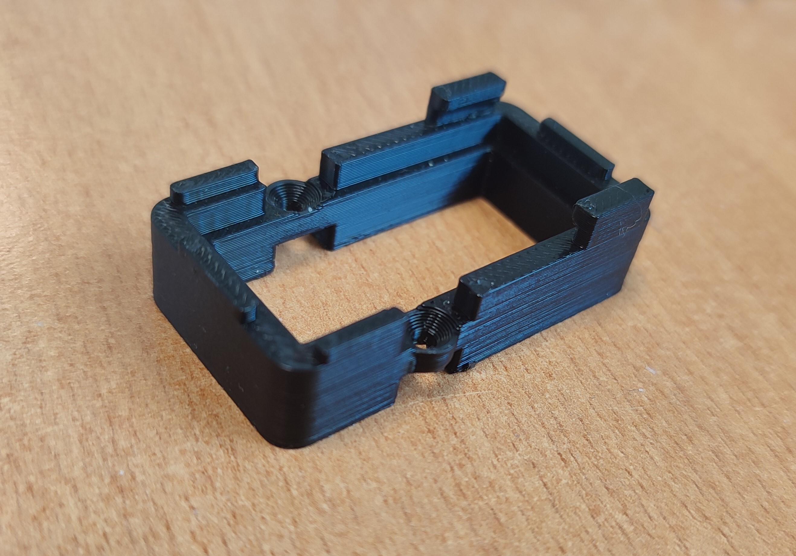
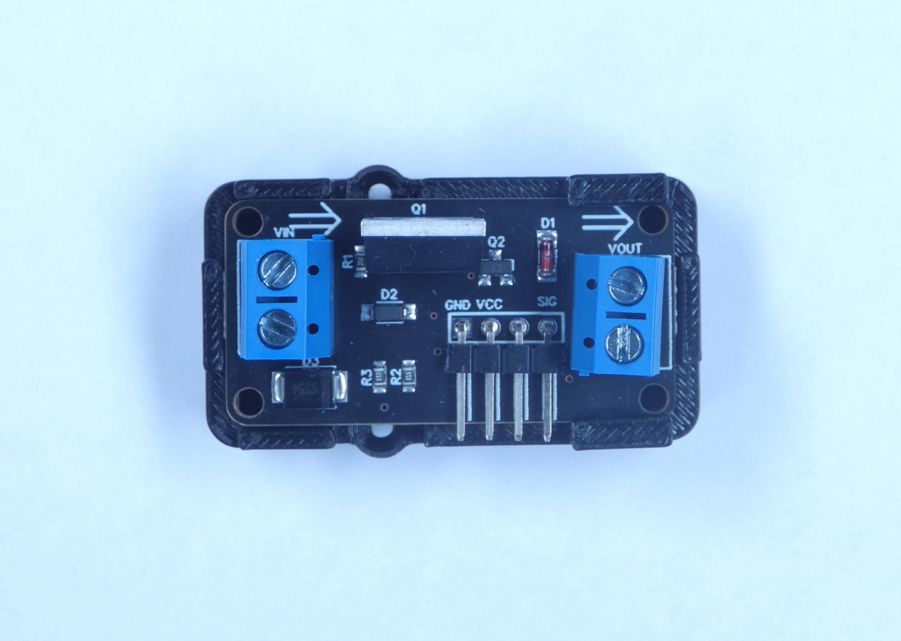
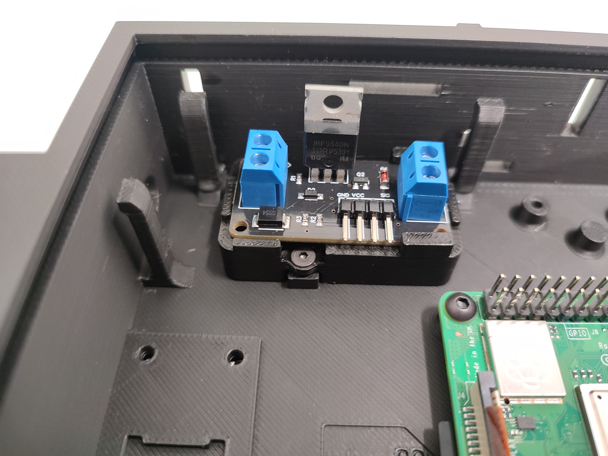
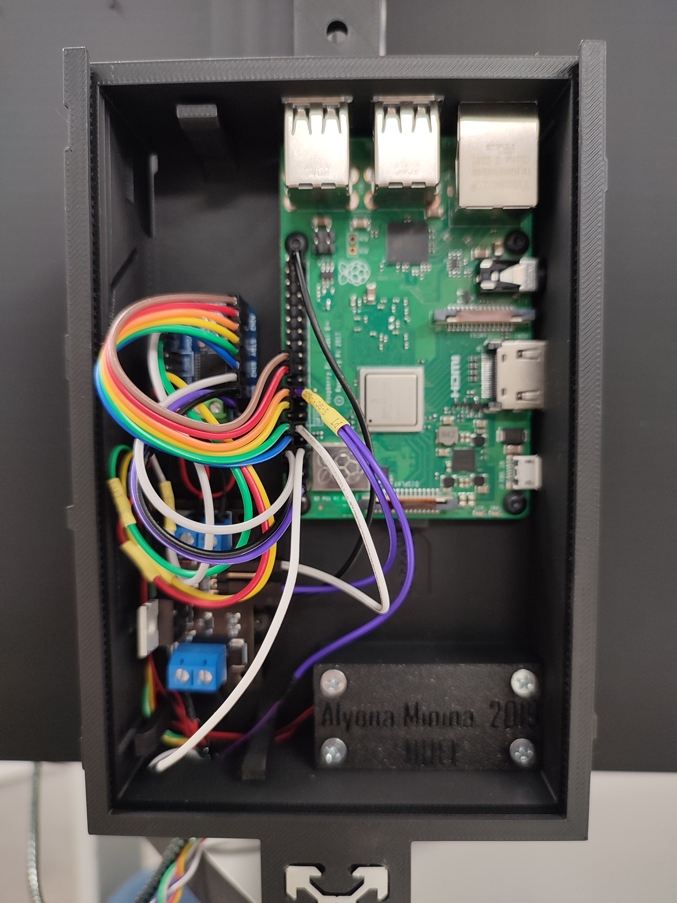
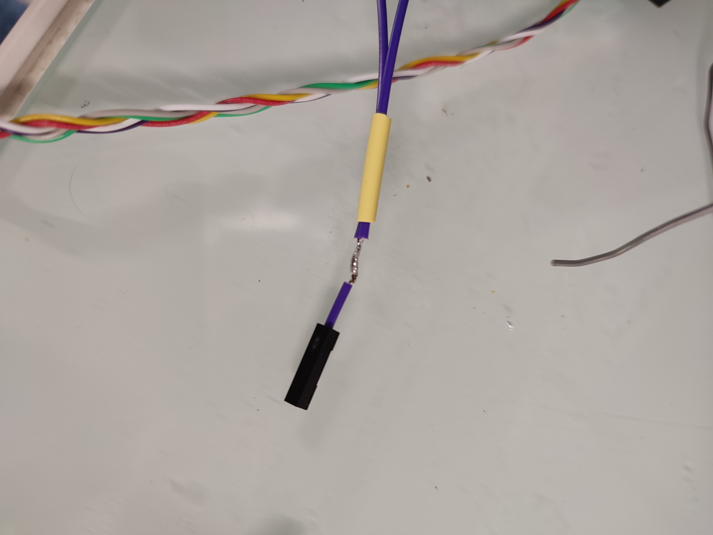
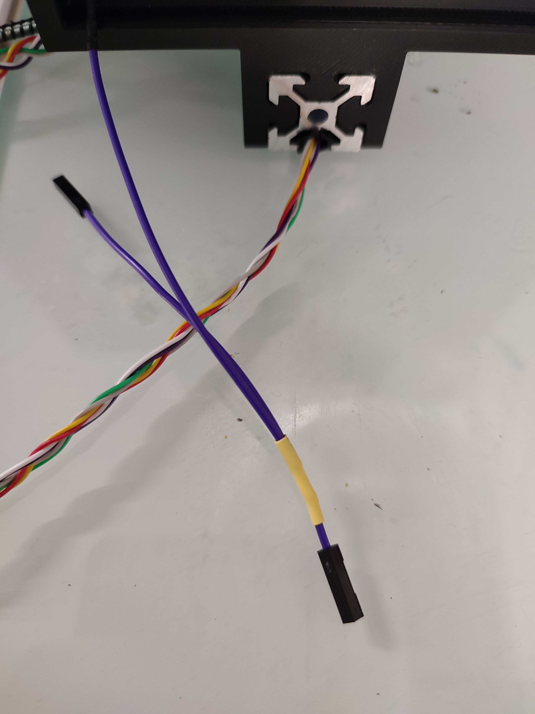

The "SparkFun MOSFET Power Control Kit" seems to be discontinued, therefore we propose the "Joy-it COM-MOSFET Voltage regulator" as a good alternative.  
Steps to follow:
- 3D print the [com-mosfet adapter](stl/com-mosfet_adapter.stl), then screw it where the Sparkfun MOSFET should be placed;
- Slide the com-mosfet into the adapter;
- Connect the GND to a RaspberryPi GND pin;
- Connect the VCC to a RaspberryPi 3.3V pin : for this step you need to solder a jumper wire to an existing 3.3v wire already used, since there should be no 3.3v output available on the RaspberryPi.

Pictures :

